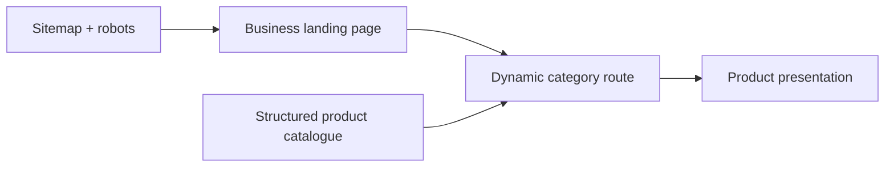

# Icon Enterprise

A production catalogue website built for a business client to present industrial and construction products through a fast, responsive web experience.

[Live application](https://icon-enterprise.vercel.app) · [Portfolio case study](https://you-three-snowy.vercel.app/projects/icon-enterprise)

## Project purpose

The client needed a credible digital catalogue without the operational overhead of a full commerce platform. Icon Enterprise organizes product categories, imagery, service information, and business details into a customer-facing site that works across desktop and mobile devices.

## Highlights

- Dynamic category pages driven by structured product data.
- Reusable navigation, catalogue, company, and footer components.
- Responsive layouts built with Tailwind CSS.
- Product imagery and downloadable brochure assets.
- Search-engine support through sitemap and robots routes.
- Production deployment on Vercel.

## Architecture



## Technology

`Next.js 15` · `React 19` · `Tailwind CSS` · `Vercel`

## Main routes

| Route | Purpose |
| --- | --- |
| `/` | Company introduction, services, and catalogue entry points |
| `/services/[category]` | Dynamic product category display |
| `/display` | Additional product presentation view |
| `/sitemap.xml` | Search-engine sitemap |
| `/robots.txt` | Crawler rules |

## Local setup

```bash
git clone https://github.com/alwayssaheb/Icon-Enterprise.-.git
cd Icon-Enterprise.-
npm install
npm run dev
```

Open `http://localhost:3000`.

## Project structure

```text
src/app
├── component             # Reusable business UI
├── services/[category]   # Dynamic catalogue categories
├── display               # Product display route
├── sitemap.xml           # Sitemap route
└── robots.txt            # Robots route
products/products.json    # Catalogue content
public                    # Product images and brochure
```

## Author

Designed and developed by [Saheb Singh](https://github.com/alwayssaheb) for a business client.
